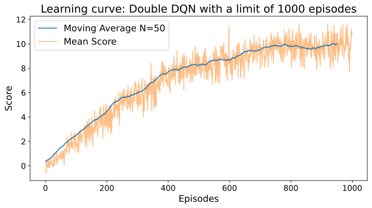

# Introduction

The main objetive of this project is to apply Value-Based Deep Reinforcement Learning methods to solve the Banana Collector environment. 
The environment is described below:

The simulation contains a single agent that navigates a large environment.  At each time step, the agent has to choose between four actions:
- `0` - walk forward 
- `1` - walk backward
- `2` - turn left
- `3` - turn right

The state space has `37` dimensions and contains the agent's velocity, along with ray-based perception of objects around agent's forward direction.  A reward of `+1` is provided for collecting a yellow banana, and a reward of `-1` is provided for collecting a blue banana. 

The algorithm selected in this project was a variation of the vanilla Deep Q-Network, the Double DQN algorithm.

# Implementation and Results

## The model

    The model architecture is cascaded except by the Advantage-Baseline part. The code snippet shown below describes the network:

```    num_neurons=48
    fc1 (37, 48)
    fc2 (48, 48)
    fc_advantage = (48, 4)
    fc_baseline = (48, 1)

    x = self.fc1(state)
    x = F.relu(x)
    x = self.fc2(x)
    x = F.relu(x)
    advantage = F.relu(self.fc_advantage(x))
    baseline = F.relu(self.fc_baseline(x))
```
##  Hyperparametes 
 
 The table below sumarizes the network hyperparameters

 | **Layer**         | **Input size** | **Output Size** |
|-------------------|----------------|-----------------|
| Input layer (fc1) |       37       |        48       |
| fc2               |       48       |        48       |
| advantage_fc      |       48       |        4        |
| baseline_fc       |        4       |        1        |


## Training 

The training consists in a  simple loop structure. In this structure, the learning agent interact with the environment`n_episodes`, until the each of the episodes end, which occurs when the environments return the `done` flag. The episodes contains 300 steps until the end, so the agent has to be time-efficient to achieve better results.

The exploration strategy is a exponentially decaying epsilon-greedy. The agent starts with epsilon=`eps_start`, decaying with a factor `eps_decay`, until a limit, called `eps_end` to maintain a minimum of exploration even at the end of the training loop.

The agent interacts and learns at each step, using the Double DQN algorithm.

To get more statistically relevant results, the analysed score is composed by a mean a moving average with the the number of samples corresponding to `WINDOW_SIZE`


The parameters used are described in the table below:

| **Parameter**       | **value** |
|----------------------|-----------|
|       eps_start      |    1.0    |
|        eps_end       |    0.01   |
|       eps_decay      |    995    |
|      n_episodes      |    1000   |
|         t_max        |    300    |
| SCORE_STOP_CONDITION |     13    |
|      WINDOW_SIZE     |    100    |

## Final scoring and Model benchmarking

The agent was able to achieve mean score 13  after 630 episodes.

To make the results more statistically relevant,  the learning process was tested over 20 different random_seeds, and it was taken the average of the 20 learning process.



## Future work

    The project presented in this report is only scratching the surface of the state of the art of value-based learning methods. As future improvements, it can be done the following:
    - Improve the statistical analysis relevance and metrics quality
    - Implement a full Rainbow algorithm, instead of a Double DQN.
    - Improve the network architecture
    - Train the agent with raw pixel data
